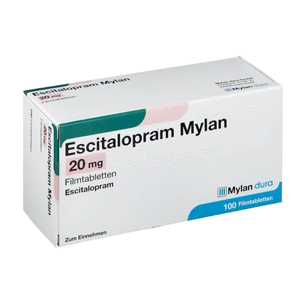

# Pathologisation — Design & FX Reference

> All changes are made in `twine-twee-edit/story.twee`, then compiled with `python3 twee_to_html.py`.

---

## 1. PASSAGE TAGS

Add tags in the passage header: `:: Passage Name [tag1 tag2] {...}`

### Visual / Font Tags

| Tag | Effect | Currently used on |
|-----|--------|------------------|
| `titlescreen` | Title screen layout, no home button, no font combos, static background, special link styling | Title Screen |
| `breakdownfont` | Body text at 2.5× size, links pinned to 48px | Park Psychosis |
| `psychosis` | Termina body text at 1em (overrides breakdownfont), chromatic aberration, wandering smooth1–4 hooks, smooth5 fake escape link, cummings body text layout (10s delay), no font combos, no home button | Park Psychosis, Public Toilet Psychosis |
| `blue` | Blue background (`#0029a3`) | GP Daydream |

### Background Image Tags

Add the tag and its image path in `TAG_BACKGROUNDS` (Story JavaScript):

| Tag | Image | Currently used on |
|-----|-------|------------------|
| `waitingroom` | `backgroundwaiting.jpg` | GP Reception |
| `parkinglot` | `parkinglot.jpg` | Car Park |
| `GP` | `gp.jpg` | GP Office 1, GP Reassess |
| `GP2` | `gpoffice.jpg` | GP Confess, GP Lie |
| `parkbench` | `parkbench.jpg` | Park Encounter |
| `static` | `static.gif` | Title Screen |
| `parkpsychosis` | `parkpsychosis.gif` | Park Psychosis |
| `brokentoilet` | `brokentoilet.jpg` | Public Toilet Psychosis |
| `cigarettes` | `cigarettes.jpg` | Cigarette Break |
| `doctorsoffice3` | `gp3.jpg` | GP Office 2 |
| `elevator` | `elevator.jpg` | Elevator |
| `psychward` | `psychward.jpg` | Psych Ward |
| `toilet` | `toilet.jpg` | Public Toilet |
| `ezymart` | `ezymart.jpg` | Ezymart |
| `nightambience` | `nightambience.jpg` | Night Walk |
| `medbg` | `dreamlike.gif` | GP Reflection |

**To add a new background:** drop the image in `images/`, add one line to `TAG_BACKGROUNDS`, add the tag to your passage.

### Breathing Background Tag

| Tag | Effect |
|-----|--------|
| `breathe` | Makes background image slowly scale/darken/saturate (inhale/exhale). On solid-colour rooms, uses filter animation instead. **GIFs never breathe** (too busy). |

Currently used on: Car Park, Park Encounter, GP Daydream, Public Toilet.

### Audio Tags

Auto-plays a looping track when entering, stops when leaving:

| Tag | Track | Currently used on |
|-----|-------|------------------|
| `clockroom` | `clock.mp3` | GP Office 1, GP Confess, GP Lie, GP Reassess |
| `parkbench` | `crickets.mp3` | Park Encounter |
| `nightambience` | `electrichum.mp3` | Night Walk |
| `phonepsychosis` | `electricwhine.mp3` | Phone Psychosis |
| `theftpsychosis` | `siren.mp3` | Theft Psychosis |

**To add a new room track:** add the audio file to `audio/`, register it in `hal.tracks` passage, add one line to `TAG_TRACKS` in Story JavaScript.

### Effect Tags (ready to use, not yet applied)

| Tag | Effect |
|-----|--------|
| `echo` | Ghosted shadow of the passage text drifts slightly offset, slowly animated. JS rewrites it with tense/subject shifts (I→you, was→is, etc.). |
| `dissolve` | ~30% of words in the passage slowly fade to invisible over 3–15s after arrival. |
| `contradict` | Words marked with `data-contradict="alt text"` typewriter-overwrite themselves with the alt, then erase, loop. |

**Usage:**
- Add tag to passage header
- For `contradict`, also wrap words in passage: `<span data-contradict="replacement">original</span>`

### Decor Tag

| Tag | Effect |
|-----|--------|
| `decor` | Marks a passage as a decor definition for another passage. Must be named `"{Passage Name} decor"`. |

**Format of a decor passage:**
```
# comment lines start with #
# Optional first line:
slab: br

Your intrusion text here
all lines become one floating block
| lg

```
Size options: `xxl xl lg md sm xs`

Intrusion text floats in the background in **Nimbus Roman**, large, low opacity, slowly drifting.

**Currently has decor:** GP Office 2 (poem block).  
**To add decor to any passage:** create a new passage named `"Passage Name decor"` with tag `[decor]`.

---

## 2. NAMED HOOKS (Inline, in passage content)

### `|charged>[word]`
Word softly blurs and fades in/out on a 4s cycle. Feels like a word losing focus.

```
The |charged>[resonant] ticks.
```
Currently used in: GP Office 1.

### `|smooth1>` `|smooth2>` `|smooth3>` `|smooth4>`
**Psychosis rooms only.** Text fragments that wander randomly across the screen continuously. Use `(either:)` for random text.

```
|smooth1>[(either: "What are you doing?", "Are you ok?")]
|smooth2>[(either: "You look retarded.", "Wanna punch on?")]
```
Font: **Termina**. Currently used in: Park Psychosis, Public Toilet Psychosis.

### `|smooth5>`
**Psychosis rooms only.** The fake escape link. Hidden for 5s, then appears at a random screen position. After clicking, lingers 2.5s then fades out. Use with `(link-replace:)`.

```
|smooth5>[(link-replace: (either: "leave", "run", "get out"))[(either: "nice try", "you're tripping")]]
```
Font: **DejaVu Sans**. Currently used in: Park Psychosis.

---

## 3. HTML CLASSES (inline in passage content)

### `.dialogue`
Indented italic block for spoken dialogue. Lines inside with `//like this//` are rendered normal weight (attribution/speaker tag).

```html
<div class="dialogue">I don't like how it makes me feel. //you tell the doctor.//</div>
```
Dialogue blocks get a **typewriter effect** on load (character by character), staggered after the scramble animation finishes. Clicking anywhere skips it.

### `floating-img`
Image that drifts slowly around the screen. Starts hidden, pops in within 0–8s at a random position, then wanders slowly. Calm and dreamlike.

```html

```
Speed/size configurable in `startFloatingImages()`. Currently used in: GP Reflection.

### `erratic-img`
Image that moves fast and jittery, glitch-flickers opacity and colour. Starts hidden, appears within 0–3s.

```html

```
Currently used in: CRRF passages.

### `.crrf-bg-overlay`
Full-screen background image overlay (z-index below text). Used inside display sub-passages.

```html
<div class="crrf-bg-overlay" style="background-image: url('./images/static.gif')"></div>
```
Opacity: 35%. Currently used in: CRRF Background 1–4.

### `.game-link`
Styled like a `tw-link` (glow, fidget animation, flicker on hover) but on a plain `<a>` tag. Used for external links.

```html
<a class="game-link" href="https://..." target="_blank">Link text</a>
```
Currently used in: Title Screen (Ryu Konrad name, GitHub, Proof).

---

## 4. AUTOMATIC EFFECTS (always on, no configuration needed)

### Layout randomiser
Every non-psychosis, non-titlescreen passage gets a random indentation mode and a central screen position on each load. Fires on **every navigation** — the same passage looks different every visit.

**Position:** `position: fixed`, `width: 52vw` (max 800px), `top` 10–30vh, `left` 8–18%. Passage overflows visible so far-right fragments don't clip.

**How fragments are made:**
1. Content is split at `<br>` boundaries (paragraph-level)
2. Each paragraph is further split at sentence boundaries (`. ` `! ` `? `) into sentence-level fragments
3. Each fragment becomes a block `<div>` with `position: relative; left: Xvw`
4. Shifting with `left` (not `padding-left`) keeps every fragment at full width — no narrow columns

**Indentation modes** (one picked at random, `scatter` and `jump` weighted 2×):

| Mode | Pattern |
|------|---------|
| `scatter` | Two-cluster random — lines land near left edge or far right |
| `jump` | Hard alternation: even lines left, odd lines far right |
| `stagger` | Shuffled 6-step pool |
| `cascade` | Steady left-to-right sweep |
| `wave` | Sine-wave curve |
| `reverse` | Right-to-left sweep |

Max indent range: **10–32vw** (re-randomised each load). `tw-link` handlers survive because nodes are moved, not cloned. Dialogue blocks (`.dialogue`) are never split or indented.

Skipped on: `[psychosis]`, `[titlescreen]`.

### Psychosis layout (`[psychosis]` passages only)
Body text reveals in two phases:

**Phase 1 (0–10s):** Body text is hidden. Only smooth1–4 wandering hooks are visible.

**Phase 2 (10s+):** Body text fragments reveal one unit at a time at 90ms intervals (typewriter over the scattered layout). The text is pre-processed into cummings-style units:
- **Short words (≤3 letters):** each letter becomes its own line (`a` / `n` / `d`)
- **Long words (≥7 letters, 45% chance):** broken at a random position 2–5 chars in (`settl` / `ing`)
- **All units** get a wide two-pole scatter (`left: 0–6vw` or `11–26vw`) via `position: relative`

Auto-redirect at 20s fires regardless. Navigating away (e.g. home button) cancels the reveal. smooth1–5 hooks are untouched and re-appended intact.

### Scramble animation
Every passage (except psychosis) animates words in on load. Each word starts displaced from its final position with random rotation (±27.5°), scale (0.25×–2.45×), and offset (±450px x / ±250px y). Words fly to their final position using elastic overshoot easing (`cubic-bezier(0.34, 1.56, 0.64, 1)`) — each word overshoots its landing and snaps back. Settle duration is randomised per word (320–1100ms). Clicking anywhere skips instantly.

### Link fidget
All links tremble slightly in a continuous micro-animation (`fidget` keyframes, `steps(40)`). Visited links lose the animation and get a strikethrough.

### Link flicker on hover
Rapid colour flash: red → cyan → yellow → magenta → white over 0.35s.

### Breakdown distress (on `[breakdownfont]` passages)
One of three effects is randomly chosen each time:
- `bd-tremor` — shakes horizontally at high speed
- `bd-blur` — pulses in and out of focus
- `bd-glitch` — red/cyan chromatic split, fast

### Chromatic aberration (on `[psychosis]` passages)
Text-shadow snaps erratically between different red/cyan fringe intensities. Uses `steps(1)` for a sharp, digital glitch feel.

### Background `#bg-layer`
Handles all background images. Always present, invisible when no image is active. Separate from `tw-story` so breathing animation doesn't affect text.

---

## 5. AUDIO

### Global background loop
`background.mp3` loops continuously from the first passage. Never stops.

### Manual track calls (in passage content)
```
(track: 'trackname', 'play')
(track: 'trackname', 'loop', true)
(track: 'trackname', 'seek', 5)
(track: 'trackname', 'stop')
```

### Registered tracks

| ID | File | Status |
|----|------|--------|
| `background` | `background.mp3` | Global loop, always playing |
| `clock` | `clock.mp3` | Tag-based (`clockroom`) |
| `crickets` | `crickets.mp3` | Tag-based (`parkbench`) |
| `electrichum` | `electrichum.mp3` | Tag-based (`nightambience`) |
| `electricwhine` | `electricwhine.mp3` | Tag-based (`phonepsychosis`) |
| `siren` | `siren.mp3` | Tag-based (`theftpsychosis`) |
| `psychobirds` | `psychosisbirds.mp3` | Manual — `(track: 'psychobirds', 'play')` in Park Psychosis |
| `printer` | `printer.mp3` | Manual — `(track: 'printer', 'seek', 5)` in New Medication |

---

## 6. HARLOWE MACROS IN USE

### Navigation
```
[[Passage Name]]                    — link with passage name as text
[[Text->Passage Name]]              — link with custom text
[[Passage Name<-Text]]              — same (text on the right side)
(goto: "Passage Name")              — instant redirect, no click needed
(live: 20s)[(goto: "Passage Name")] — auto-redirect after 20 seconds
```

### Randomisation
```
(either: "a", "b", "c")            — picks one at random each render
(display: (either: "P1", "P2"))    — displays a random sub-passage
```

### Interaction
```
(link-replace: "text")[replacement] — click replaces text with replacement, no navigation
```

### Audio (HAL)
```
(track: 'id', 'play')
(track: 'id', 'stop')
(track: 'id', 'loop', true)
(track: 'id', 'seek', seconds)
```

### Sub-passage display
```
(display: "Sub-passage Name")       — embeds another passage's content inline
```

---

## 7. FONT SYSTEM

### Typekit kit
`@import url('https://use.typekit.net/vnl6sno.css')` — loads all custom fonts.

### Font combo randomiser
On every passage load (except `[titlescreen]` and `[psychosis]`), a random combo is applied:

| Combo | Body | Links | Dialogue |
|-------|------|-------|---------|
| 1 | Nimbus Roman | DejaVu Sans | Logic Monospace |
| 2 | Termina | Nimbus Roman (1.5em) | DejaVu Sans |
| 3 | Logic Monospace | DejaVu Sans | Nimbus Roman |
| 4 | DejaVu Sans | Termina | Nimbus Roman |

Dialogue always stays italic — only the family changes per combo.

### Font sizes

| Element | Size |
|---------|------|
| Global base (`tw-story`) | `1em` (browser default ≈ 16px) |
| Breakdownfont body | `2.5em` |
| Breakdownfont links | `48px !important` |
| Psychosis body (`tw-passage`) | `1em` — overrides breakdownfont |
| smooth1–4 hooks | `0.9rem !important` — overrides breakdownfont |
| smooth5 + its link | `1.25rem` |
| UI buttons (home, fullscreen) | `0.9rem` |
| Title screen links | `0.9rem` |
| Title screen author name | `clamp(1rem, 2vw, 1.4rem)` |
| Title screen description | `clamp(0.7rem, 1.4vw, 0.9rem)` |
| Combo 2 Nimbus Roman links | `1.5em` |

### Fixed fonts (always, regardless of combo)

| Element | Font |
|---------|------|
| Psychosis body text | Termina |
| smooth1–4 wandering hooks | Termina |
| smooth5 escape link | DejaVu Sans |
| Title screen Start link | Termina |
| Title screen description | Logic Monospace |
| Title screen "Ryu Konrad" link | Termina |
| Title screen GitHub + Proof links | Nimbus Roman |
| Home button | Termina |
| Fullscreen button | Termina |
| Intrusion words | Nimbus Roman |

---

## 8. CRRF SYSTEM (Complete Random Reality Fragmentation)

A modular randomised passage system. Each CRRF passage assembles itself from 4 random pools:

```
(display: (either: "CRRF Background 1", "CRRF Background 2", ...))
(display: (either: "CRRF Image 1", "CRRF Image 2", ...))
(display: (either: "CRRF Text 1", "CRRF Text 2", ...))
(display: (either: "CRRF Links 1", "CRRF Links 2", "CRRF Links 3"))
```

**To add a new option to any pool:** create a new passage (e.g. `CRRF Text 5`) and add its name to the `(either:)` list.

**Current pools:**
- **Background 1–4:** full-screen overlay images (static.gif, parkpsychosis.gif, psychward.jpg, nightambience.jpg)
- **Image 1–4:** erratic-img (static.gif, dreamlike.gif, parkpsychosis.gif, brokentoilet.jpg)
- **Text 1–4:** short placeholder text fragments
- **Links 1–3:** navigation options (currently all lead to Home / Psych Ward)

**Currently used on:** CRRF 1, 2, 3, 4 (four distinct passages using the same pool system).

---

## 9. LINK BEHAVIOUR

| State | Appearance |
|-------|-----------|
| Unvisited | White at 90% opacity, glow, fidget animation |
| Visited | 55% opacity, strikethrough, no animation |
| Hover | Colour flicker (red→cyan→yellow→magenta→white), stays fidgeting |
| Visited hover | No change (locked) |

Title screen links: no fidget animation (they're UI, not choices). Border box style.

---

## 10. QUICK RECIPE GUIDE

**New room with background + audio:**
```
:: Room Name [mytag breathe] {"position": "x,y", "size": "100,100"}
```
Add to `TAG_BACKGROUNDS`: `'mytag': './images/myimage.jpg'`  
Add to `TAG_TRACKS`: `'mytag': 'mytrack'`

**Random text in passage:**
```
(either: "option one", "option two", "option three")
```

**Wandering psychosis fragment:**
```
|smooth1>[(either: "text a", "text b")]
```

**Fake escape link:**
```
|smooth5>[(link-replace: (either: "leave", "run"))[(either: "nice try", "not yet")]]
```

**Auto-redirect after delay:**
```
(live: 20s)[(goto: (either: "Passage A", "Passage B"))]
```

**Dissolving/echo/contradict passage:**
Add tag `[dissolve]`, `[echo]`, or `[contradict]` to the passage header.

**Decor (floating background text):**
Create `:: My Passage decor [decor]` with the intrusion poem text.

**External link styled as game link:**
```html
<a class="game-link" href="https://..." target="_blank">link text</a>
```

**Layout randomiser — suppress for a passage (opt-out):**
Add `psychosis` or `titlescreen` tag. No per-passage disable otherwise — it always runs on normal passages.
