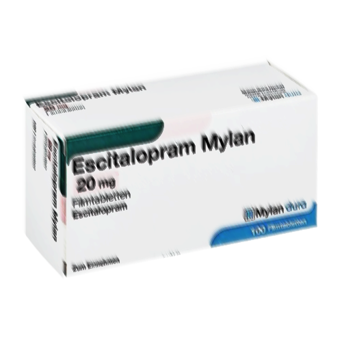

# Pathologisation — Design & FX Reference

> All changes are made in `twine-twee-edit/story.twee`, then compiled with `python3 twee_to_html.py`.
>
> **Start passage:** always `Title Screen` — enforced by `"start": "Title Screen"` in `StoryData`. Every compile sets `startnode` correctly regardless of what Twine last saved. To confirm in Twine: Title Screen passage should show the rocket/start marker; if not, right-click → Start Story Here.
>
> **Twine → code workflow:** edit in Twine → save → `cd twine-twee-edit && python3 html_to_twee.py` (reads from `pathologisation/index.html`) → make code edits to `story.twee` → `python3 twee_to_html.py`.
>
> **README page:** `readme.html` is regenerated from `README.md` on every compile via `readme_to_html.py` — edit `README.md`, never `readme.html`.
>
> **Proof:** `proof.html` is auto-regenerated on every `twee_to_html.py` compile via `twee_to_proof.py`. Run `python3 twee_to_proof.py` standalone to regenerate without a full compile.
>
> **Folder layout:** `twine-twee-edit/` must sit next to `pathologisation/` (both in `~/Desktop/digital-writing/`) — all scripts read/write `../pathologisation/` relative to themselves. A stale backup copy of both folders also exists in `~/Documents/digital-writing/`; don't edit there.
>
> **File names:** all images and audio use simple one-word lowercase names — room backgrounds are named after their tag (e.g. `examroom.jpg`), CRB backgrounds `crb1–4`, collage images `<folder><n>` (e.g. `city4.jpg`). Keep new files to the same pattern. The old→new list is in `~/Desktop/digital-writing/pathologisation-image-originals/RENAME-MAP.txt`.
>
> **Images:** large JPG/PNGs were resized (max 2560px long edge) and JPGs re-saved at 82% quality on 1 Oct 2026 — same filenames and formats. Full-resolution originals are backed up in `~/Desktop/digital-writing/pathologisation-image-originals/` (outside the repo). GIFs were left untouched. When adding new images, keep them around 2560px / under ~2MB.
>
> **Credits:** third-party image/audio/font credits and the content warning are in `README.md` — add new sources there.
>
> **Audit:** `audit.py` runs automatically after `html_to_twee.py` (full report) and after `twee_to_html.py` (snapshot only). It flags missing assets and anything in this file that's out of sync with the code.

---

## 1. PASSAGE TAGS

Add tags in the passage header: `:: Passage Name [tag1 tag2] {...}`

### Visual / Font Tags

| Tag | Effect | Currently used on |
|-----|--------|------------------|
| `titlescreen` | Title screen layout, no font combos, static background, special link styling. Has a `::before` black overlay at `rgba(0,0,0,0.4)` to dim the background without fully obscuring collage images. | Title Screen |
| `breakdownfont` | `redaction-20` body at 1.1em, links `tt-hoves-pro` at 1em, random BD distress effect (tremor/blur/glitch), normal layout but with a smaller indent range (2–7vw) and top constrained to 3–15vh. Do not combine with `[psychosis]` — psychosis overrides all breakdownfont visuals. | Psych Ward, Train, Drugs, Smash Up, Abuse Witch |
| `psychosis` | `redaction-50` body at `1.5rem !important`, chromatic aberration, cummings body layout, no font combos, no BD distress effects. Passages *with* smooth hooks get wandering smooth1–4 + smooth5 fake escape link; passages *without* hooks get the wide CRB-style layout (see §4). | With hooks: Park Psychosis, Exeloo Episode. Without hooks: Mirror, Phone Psychosis, Theft Psychosis, Psych Ward Stay, Complete Reality Breakdown 1–4. Also GP Office Final Randomised (with `ending`, see §9) |
| `ending` | Combined with `psychosis`: replaces the passage with the JS ending scatter (§9) | GP Office Final Randomised |
| `pinktexture` | `pinktexture.gif` background | GP Reflection |
| `floating` | Loads all images from `FLOATING_POOL` (Story JavaScript) as drifting `floating-img` elements. No `` tags needed in passage. Add paths to `FLOATING_POOL`, drop files in `images/floating/`. | GP Reflection, GP Office 2, Pharmacy |

### Background Image Tags

Add the tag and its image path in `TAG_BACKGROUNDS` (Story JavaScript):

| Tag | Image | Currently used on |
|-----|-------|------------------|
| `waitingroom` | `backgroundwaiting.jpg` | GP Reception |
| `parkinglot` | `parkinglot.gif` | Car Park |
| `GP` | `gp.jpg` | GP Office 1, GP Reassess |
| `GP2` | `gpoffice.jpg` | GP Confess, GP Lie |
| `parkbench` | `parkbench.jpg` | Park Encounter |
| `static` | `static.gif` | Title Screen |
| `parkpsychosis` | `parkpsychosis.gif` | Park Psychosis |
| `brokentoilet` | `brokentoilet.jpg` | Exeloo Episode |
| `doctorsoffice3` | `gp3.jpg` | GP Office 2 |
| `examroom` | `examroom.jpg` | GP Office 3, GP Office 3 Scream, GP Office 3 Kill |
| `examroomdark` | `gpfinal.jpg` | GP Office 2 Abuse, GP Office Final Randomised (ending) |
| `cliniccorridor` | `cliniccorridor.jpg` | GP Office 2 Unsure |
| `cliniccorridor2` | `cliniccorridor2.jpg` | New Medication |
| `clinicwaiting` | `clinicwaiting.jpg` | Psych Ward Escape |
| `hospitalward` | `hospitalward.jpg` | Psych Ward Stay |
| `psychward` | `psychward.jpg` | Psych Ward |
| `elevator` | `elevator.jpg` | Elevator |
| `toilet` | `toilet.jpg` | Exeloo |
| `ezymart` | `ezymart.jpg` | Servo |
| `servotv` | `servotv.jpg` | Servo 2 |
| `pharmacy` | `pharmacy.png` | Pharmacy |
| `phonefog` | `phonefog.png` | Phone |
| `phonepsychosis` | `phonepsychosis.jpg` | Mirror, Phone Psychosis |
| `publictiolet` | `publictoilet.jpg` | Phone Toilet |
| `nightambience` | `nightambience.jpg` | Night Walk |
| `citywalk` | `citywalk.png` | Witch Encounter |
| `citycommute` | `citycommute.png` | City Transit |
| `glitter` | `lightjitter.gif` | City Dissociation |
| `parliamentstation` | `parliamentstation.jpg` | Train |
| `stationunderpass` | `stationunderpass.jpg` | Jail Escape |
| `jail` | `jail.jpg` | Jail |
| `jailstay` | `jailstay.jpg` | Jail Stay |
| `librarylookout` | `librarylookout.jpg` | The Faces |
| `nightalley` | `nightalley.jpg` | Smash Up |
| `citychurch` | `citychurch.jpg` | Abuse Witch |
| `fluoro` | `fluoro.jpg` | Ignore Witch |
| `theftpsychosis` | `theftpsychosis.gif` | Theft Psychosis |
| `pinktexture` | `pinktexture.gif` | GP Reflection |
| `homedecay` | `homedecay.jpg` | Home |
| `demolished` | `abstractsurface.jpg` | Drugs |
| `naturlworld` | `naturalworld.jpg` | Dream |

**No static background** (collage only): GP Daydream, Cigarette, Insomnia. CRB 1–4 use `CRB_BACKGROUNDS` instead (§8).

**To add a new background:** drop the image in `images/`, add one line to `TAG_BACKGROUNDS`, add the tag to your passage.

**Critical backgrounds preloaded at page load:** `gpfinal.jpg` and `brokentoilet.jpg` are preloaded via `new Image()` at the very top of Story JavaScript (`window._gpBgImg`, `window._toiletBgImg`) to ensure they're available on first visit without a page refresh. If you replace these images, update both `TAG_BACKGROUNDS` and those two preload lines.

### Audio Tags

Auto-plays a looping track when entering, stops when leaving:

| Tag | Track | Currently used on |
|-----|-------|------------------|
| `clockroom` | `clock.mp3` | GP Office 1, GP Confess, GP Lie, GP Reassess |
| `parkbench` | `crickets.mp3` | Park Encounter |
| `nightambience` | `electrichum.mp3` | Night Walk |
| `phonepsychosis` | `electricwhine.mp3` | Phone Psychosis |
| `theftpsychosis` | `siren.mp3` | Theft Psychosis |
| `parkinglot` | `traffic.mp3` | Car Park |
| `parkpsychosis` | `psychosisbirds.mp3` | Park Psychosis |
| `parliamentstation` | `train-arrive` (underground train pulls into station) | Train |
| `stationunderpass` | `tube-announce` (mind the gap) | Jail Escape |
| `hospitalward` | `alarm-clock` (mechanical alarm clock ticking) | Psych Ward Stay |
| `jailstay` | `whitenoise` (offbeat white noise) | Jail Stay |
| `jail` | `metal-door` (metal door groans) | Jail |

Note `phonepsychosis` is shared by Mirror and Phone Psychosis, so both play `electricwhine`.

**To add a new room track:** add the audio file to `audio/`, register it in `hal.tracks` passage, add one line to `TAG_TRACKS` in Story JavaScript.

### Collage Tags

`[collage]` must be paired with a named category tag, which picks the image folder (there is no default pool — `[collage]` alone shows nothing). Tags are **independent from decor tags** — mix and match freely.

| Tag | Folder | Currently used on |
|-----|--------|------------------|
| `collage` | required on all collage passages | — |
| `collage-medical` | `images/collage/medical/` (11 images) | GP Reception, GP Office 1, GP Confess, GP Lie, GP Reassess, New Medication, GP Office 2, GP Office 2 Abuse, GP Office 2 Unsure, GP Office 3, GP Office 3 Scream, GP Office 3 Kill, Psych Ward, Psych Ward Escape, Psych Ward Stay, GP Office Final Randomised |
| `collage-natural` | `images/collage/natural/` (13 images) | Park Encounter, Park Psychosis, Dream |
| `collage-city` | `images/collage/city/` (21 images) | Car Park, Exeloo, Exeloo Episode, Elevator, Night Walk, City Dissociation, Witch Encounter, Abuse Witch, Ignore Witch, City Transit, Train, The Faces, Smash Up, Theft Psychosis, Jail, Jail Escape, Jail Stay |
| `collage-gloss` | `images/collage/gloss/` (13 images) | Phone, Phone Toilet, Phone Psychosis, Mirror, Pharmacy, Servo, Servo 2 |
| `collage-subsist` | `images/collage/subsist/` (16 images) | GP Daydream, GP Reflection, Home, Cigarette, Insomnia, Drugs |
| `collage-title` | `images/collage/title/` (11 images) | Title Screen |
| `collage-psychosis` | `images/collage/psychosis/` (5 images) | Complete Reality Breakdown 1–4 (also triggers the `CRB_BACKGROUNDS` random background) |

**Image sizing:** width randomised 45–85vw per image, max-height 85vh. All pools use the same sizing function — title screen is not differentiated.

**Right-edge clamping:** `left` position is clamped to `100 - w * 0.5` so at most half an image can overflow the right edge of the viewport.

**To add a new category:** create `images/collage/newname/`, add a `'collage-newname': []` entry to `COLLAGE_POOLS` in Story JavaScript with image paths, then tag passages `[collage collage-newname]`.

**To add images to an existing pool:** drop files into the folder and add their paths to `COLLAGE_POOLS['collage-category']`.

**Image size limit:** keep every image to **2560px on its longest side** (about 5 megapixels). iPhone browsers (Safari and Chrome, both WebKit) can refuse to decode very large images and show a blue "?" box instead — this happened in Exeloo with a 3474×4632 `city12.jpg`. On 1 Oct the six oversized collage images (`city12`, `gloss6`, `subsist6`, `title6`, `natural3`, `natural4`) were resized to 1920×2560 with `sips -Z 2560`; full-size originals are in `pathologisation-image-originals/pre-resize-2026-10-01/`.

Combines cleanly with all other tags. Can be used with `[psychosis]` but may be visually busy.

### Decor Tags

Pool-based system — tag a passage `[decor decor-medical]` etc. to add it to that category's pool. On each load, one entry is picked at random. Multiple passages with the same category tag build up the pool. **Completely independent from collage tags.**

| Tag | Pool passage | Font | Currently used on |
|-----|-------------|------|------------------|
| `decor-medical` | `Medical Decor` | combo redaction (10–50) | All `collage-medical` passages except GP Reception |
| `decor-city` | `City Decor` | combo redaction (10–50) | All `collage-city` passages except Exeloo Episode and Theft Psychosis |
| `decor-gloss` | `Gloss Decor` | combo redaction (10–50) | Phone, Phone Toilet, Pharmacy, Servo, Servo 2 |
| `decor-subsist` | `Subsist Decor` | combo redaction (10–50) | GP Daydream, GP Reflection, Home, Cigarette, Insomnia, Drugs, Exeloo Episode |
| `decor-natural` | `Natural Decor` | combo redaction (10–50) | Park Encounter, Dream |
| `decor-crb` | `CRB Decor Pool` | random `redaction-70` or `redaction-100` | Complete Reality Breakdown 1–4 |

**Format of a decor passage** — write in Twine, each option ends with `| size`:
```
Your first intrusion text
across multiple lines
| md
A second option here
different text
| lg
A third option.
| sm
```
Size options: `xxl xl lg md sm xs`. Lines starting with `#` are comments. One block is picked at random on each load. The `| size` line ends each block — no separator needed. `---` on its own line also works as an explicit separator.

**To add options:** write them directly in the category passage (e.g. `Medical Decor`) separated by `---`. The passage appears in the **Decor** section of the proof.

**To add a new category:** add `'decor-newname': []` to `DECOR_POOLS` in Story JavaScript, then tag passages `[decor-newname]`.

### Effect Tags

| Tag | Effect | Currently used on |
|-----|--------|------------------|
| `echo` | Ghosted shadow of the passage text drifts slightly offset, slowly animated. JS rewrites it with tense/subject shifts (I→you, was→is, etc.). | Night Walk, Insomnia |

---

## 2. NAMED HOOKS (Inline, in passage content)

### `|charged>[word]`
Word softly blurs and fades in/out on a 4s cycle. Feels like a word losing focus.

```
The |charged>[resonant] ticks.
```
Added manually — not automatic. Currently used in: GP Reassess, GP Office 2, Park Encounter, Phone, Dream, Home, Insomnia, Drugs, The Faces, Smash Up, Abuse Witch.

### `|smooth1>` `|smooth2>` `|smooth3>` `|smooth4>`
**Psychosis rooms only.** Text fragments that wander randomly across the screen continuously. Text is injected from a `[fragment-pool]` passage — leave the hook empty in the passage:

```
|smooth1>[ ]
|smooth2>[ ]
```
Font: **`velvelyne`** 1.6rem. Currently used in: Park Psychosis, Exeloo Episode.

Wander behaviour: each hook becomes a body-level proxy assigned its own shuffled screen quadrant, with occasional full-screen breakout moves. Starts moving immediately on arrival. Speed: 100–400ms per move.

### `|smooth5>`
**Psychosis rooms only.** The fake escape link. Appears at 2s at a random screen position as a body-level proxy with JS chromatic aberration. After clicking, the Harlowe response lingers 2.5s then fades out. Use with `(link-replace:)`. Currently used in: Park Psychosis, Exeloo Episode (and GP Office Final Randomised, where the ending scatter replaces it).

```
|smooth5>[(link-replace: (either: "leave", "run", "get out"))[(either: "nice try", "you're tripping")]]
```
Font: **`tt-hoves-pro`**. Currently used in: Park Psychosis.

---

## 3. HTML CLASSES (inline in passage content)

### `.dialogue`
Indented italic block for spoken dialogue. Lines inside with `//like this//` are rendered normal weight (attribution/speaker tag).

```html
<div class="dialogue">I don't like how it makes me feel. //you tell the doctor.//</div>
```
Dialogue blocks get a **typewriter effect** on load (character by character), staggered after the scramble animation finishes. Clicking anywhere skips it.

### `floating-img`
Image that drifts slowly around the screen. Starts hidden, pops in within 0–8s at a random position, then wanders slowly. Calm and dreamlike.

```html

```

**Architecture:** Images in the passage are only used as a source list. `startFloatingImages()` reads their `src` attributes, **hides the originals** (`el.style.display = 'none'`), then creates fresh `` clones inside a dedicated `#floating-layer` div (position: fixed, inset: 0, z-index: 5 — above `#bg-layer` at z:-1, below `tw-passage` at z:100), and wanders them from there. The `#floating-layer` is cleared on each navigation.

**Why hide originals:** Original `` elements remain in the passage DOM after `startFloatingImages` clones them. They have `position: absolute` from the CSS, so they end up stacked at the top-left of their nearest `position: relative` ancestor (a sentence div in the layout system). The `float-breathe` animation then makes the stack visibly pulse in one spot. Setting `display: none` on each original as its src is collected eliminates this.

**Important:** Wrap the `` tags in a container div — do NOT put them as bare children of the passage root. The layout system (`splitAtSentences`) filters out subgroups with no text content; a bare `` with no surrounding text would be silently dropped from the rebuilt DOM. Wrapping in a `<div>` preserves them as element nodes.
Speed/size configurable in `startFloatingImages()`. Currently used in: GP Reflection, GP Office 2, Pharmacy via `[floating]` tag. Floating images live in `images/floating/` (medication PNGs: escitalopram, ambien, seroquel, valium, zopiclone, ativan, paxam, zyprexa).

**Note:** floating images use `position: fixed; z-index: -1`. They only show if `tw-story` is transparent (`has-bg-image` class). Image-backed and collage rooms add `has-bg-image` via JS, so floating images show. Do not give `tw-story` a CSS `background-color` for any room that has floating images.

**Pool system:** Tag a passage `[floating]` to automatically load all images from `FLOATING_POOL` in Story JavaScript — no `` tags needed in the passage. Add paths to `FLOATING_POOL` to grow the pool. Hardcoded `` tags still work alongside the pool.

### `.game-link`
Styled like a `tw-link` (glow, fidget animation, flicker on hover) but on a plain `<a>` tag. Used for external links.

```html
<a class="game-link" href="https://..." target="_blank">Link text</a>
```
Currently used in: Title Screen (Ryu Konrad name, ReadMe, Proof).

**Title Screen author block structure:**
- `.wk-author-name` — "Ryu Konrad" link, `redaction-70` regular weight, no fidget/flicker, no strikethrough
- `.wk-info` — credit line ("eLiterature work created for Digital Writing, RMIT (2026)."), `redaction-50` italic
- `.wk-desc` — description text, `redaction-20`. Current text: "Pathologisation — psychosis, insatiability and uncertainty within the structures and routines of modernity. A simulation of a relentless mess of noise and impossibility, where reality crumbles under the weight of the mind. Pathologisation attempts to systemise the absurd and the arbitrary — it looks for meaning where there is none."
- `.wk-warning` (with `.wk-info`) — content & photosensitivity warning under the description, same small italic style as the credit line. Its text is stripped out of the ending's word salad in `buildWordSalad()`.
- `.wk-corner` — the two corner links, both `position: fixed; bottom: 1.2rem`, `redaction-70` regular weight (matches Ryu Konrad style), no fidget, flicker on hover:
  - `.wk-readme` — "ReadMe" → `./readme.html`, bottom-left (`left: 1.4rem`)
  - `.wk-proof` — "Proof" → `./proof.html`, bottom-right (`right: 1.4rem`)
  Both open in a new tab.
- Spacing: `.wk-block` has `margin-top: -2.2em` (pulls the text up towards the ASCII title) and `.title-actions` has `margin-top: -1.8em` (pulls Start/Fullscreen up towards the warning).
- The title itself is an SVG: `images/title.svg` (`.wk-title-svg`, sized by `fitAsciiTitle()`).

---

## 4. AUTOMATIC EFFECTS (always on, no configuration needed)

### Layout randomiser
Every non-psychosis, non-titlescreen passage gets a random indentation mode and a central screen position on each load. Fires on **every navigation** — the same passage looks different every visit.

**Position:** `position: fixed`, `width: 52vw` (max 800px), `top` 3–45vh (breakdownfont: 3–15vh), `left` 5–23%.

**How fragments are made:**
1. Content is split at `<br>` boundaries (paragraph-level)
2. Each paragraph is further split at sentence boundaries (`. ` `! ` `? `) into sentence-level fragments
3. Each fragment becomes a block `<div>` with `position: relative; left: Xvw`
4. **55% chance:** a pure-text fragment (4+ words, no links) is further broken into word-group sub-lines, each with its own slightly varied indent (see letter-stacking below)
5. Shifting with `left` (not `padding-left`) keeps every fragment at full width — no narrow columns

**Indentation modes** (one picked at random, `scatter` and `jump` weighted 2×):

| Mode | Pattern |
|------|---------|
| `scatter` | Two-cluster random — lines land near left edge or far right |
| `jump` | Hard alternation: even lines left, odd lines far right |
| `stagger` | Shuffled 6-step pool |
| `cascade` | Steady left-to-right sweep |
| `wave` | Sine-wave curve |
| `reverse` | Right-to-left sweep |

Max indent range: **4–14vw** (breakdownfont: 2–7vw), re-randomised each load. `tw-link` handlers survive because nodes are moved, not cloned. Dialogue blocks (`.dialogue`) are never split or indented.

Within a word-group split, words of 2–3 letters have a **50% chance of being letter-stacked vertically** (each letter its own line), capped at **2 stacks per passage** to prevent layout overflow. Psychosis body text is unaffected — it has its own independent layout.

Skipped on: `[psychosis]`, `[titlescreen]`.

### Psychosis layout (`[psychosis]` passages only)

`applyPsychosisLayout()` behaves differently depending on whether the passage contains any smooth hooks.

**With smooth hooks** (Park Psychosis, Exeloo Episode) — passage `position: fixed; width: 42vw; top: 8vh; left: 5–50%`:
- **0s:** body text hidden. smooth1–4 wander as body-level proxies (see §2). smooth5 fake escape link appears at 2s.
- **6–10s (random):** wander stops. Each hook's text is broken into short lines and placed in its own fixed "settle" container, anchored top→bottom down the screen, lines staggering in.
- **10s:** settle containers fade out and body text reveals one unit at a time at 90ms intervals.
- **20s:** Harlowe `(live: 20s)` redirects (main text gets ~10s on screen).

**Without smooth hooks** (CRB 1–4, Mirror, Phone Psychosis, Theft Psychosis, Psych Ward Stay) — passage widened to `82vw`, `left: 3–12%`:
- Body reveals at 1.5s, then the passage's links reveal (each scattered individually) once the body finishes.
- Words grouped 4–8 per line, no letter-stacking, 8% chance of a mid-word break, wider scatter (18–33vw).
- Exits: Mirror 15s, Phone Psychosis and Theft Psychosis 10s via `(live:)`; Psych Ward Stay via a 12s JS timer to a random CRB; CRBs see §8.

**Cummings-style units (with-hooks passages):**
- **Short words (≤3 letters):** 40% chance of being letter-stacked (each letter its own line).
- **Long words (≥7 letters):** 28% chance of a mid-word break 2–5 chars in.
- **Normal words:** grouped into chunks of up to 4 per scatter div.
- Line height: `1.15` (tight, to prevent overflow).

`hospitalward` (Psych Ward Stay) skips the fragment pool and the wander entirely. Navigating away cancels the reveal cleanly and removes all proxies/settle containers.

**CSS transition gotcha — why the hook fade uses `requestAnimationFrame`:** The wander cleanup sets `el.style.transition = 'none'`. If you then set `el.style.transition = 'opacity 0.8s ease'` and `el.style.opacity = '0'` in the same synchronous JS block, the browser collapses both transition assignments into one style recalculation frame — the `none` step is never committed — and the animation may not fire. Wrapping the opacity change in a `requestAnimationFrame` ensures the `none` state is painted first; the following frame then correctly transitions from opacity 1 → 0.

**BD distress effects** (`bd-tremor`, `bd-blur`, `bd-glitch`) are suppressed when `[psychosis]` is present even if `[breakdownfont]` is also tagged.

### Scramble animation
Every passage (except psychosis and titlescreen) animates words in on load. Words are wrapped in `<span>` elements, shuffled into a **random reveal order**, then faded in one by one (`opacity 0.4s`) at 40ms intervals. No transforms or positional displacement — pure opacity fade. Spaces are plain text nodes. Clicking anywhere skips instantly. Dialogue blocks appear after the scramble completes via the typewriter effect.

### Link fidget
All links tremble slightly in a continuous micro-animation (`fidget` keyframes, `steps(40)`). Visited links lose the animation and get a strikethrough and dimmed opacity.

**Visited tracking:** two things add `.visited` to a link. (1) Harlowe itself marks any link whose *destination* passage has already been visited. (2) A JS `_visitedLinks` Map records each clicked link (with the time it was struck) keyed by **room (tw-story tags) + link text** (`visitedKey()`), and `markVisitedLinks()` re-applies `.visited` on each passage load. Keying by room means clicking "escape" in GP Confess doesn't strike through the different "escape" link in Psych Ward. Title screen links (Start, Fullscreen) are exempt from the strikethrough. **Strikethroughs expire after 2 minutes** (`VISITED_EXPIRE_MS`): each key stores the time it was first struck (Harlowe-marked links start their timer when first seen), `markVisitedLinks()` removes `.visited` once expired, and it also re-runs every 5 s so strikes clear while the player stays in a room. Clicking the link again restarts its timer.

**Reload returns to the Title Screen:** Harlowe normally resumes the game on reload from `sessionStorage` ("Saved Session"). The top of Story JavaScript deletes that key (Story JS runs before Harlowe's restore), so every page load is a fresh run — variables, the JS CRB counter and strikethroughs all reset.

**Title Screen link behaviour:**
- **Start** — `terminal-grotesque` italic uppercase (displays as START), 2.6rem, letter-spacing 0.65em, `chroma-aberration` + `chroma-pulse` animation, colour flicker on hover. No strikethrough. Styled via `.start-link` wrapper span + CSS. Links to GP Reception.
- **Ryu Konrad / ReadMe / Proof** — static (no fidget), colour flicker on hover, no strikethrough.
- **Fullscreen** — lowercase italic, no fidget, colour flicker on hover, no strikethrough. Calls `window._goFullscreen()` (standard or webkit Fullscreen API). Hidden automatically where the browser has no Fullscreen API (iPhone Safari).

### Link flicker on hover
Rapid colour flash: red → cyan → yellow → magenta → white over 0.35s.

### Breakdown distress (on `[breakdownfont]` passages, NOT `[psychosis]`)
One of three effects is randomly chosen each time:
- `bd-tremor` — shakes horizontally at high speed
- `bd-blur` — pulses in and out of focus
- `bd-glitch` — red/cyan chromatic split, fast

Suppressed entirely when passage also has `[psychosis]` tag.

### Chromatic aberration (on `[psychosis]` passages)
Text-shadow snaps erratically between different red/cyan fringe intensities. Uses `steps(1)` for a sharp, digital glitch feel.

### Background `#bg-layer`
Handles all background images. Always present, invisible when no background is active. `tw-story` is always kept transparent (`has-bg-image`) whenever a background is active, so `floating-img` elements (z-index: -1) remain visible.

---

## 5. AUDIO

### Global background loop
`background.mp3` loops continuously from the first passage. Never stops.

### Manual track calls (in passage content)
```
(track: 'trackname', 'play')
(track: 'trackname', 'loop', true)
(track: 'trackname', 'seek', 5)
(track: 'trackname', 'stop')
```

### Registered tracks

| ID | File | Status |
|----|------|--------|
| `background` | `background.mp3` | Global loop, always playing |
| `clock` | `clock.mp3` | Tag-based (`clockroom`) |
| `crickets` | `crickets.mp3` | Tag-based (`parkbench`) |
| `electrichum` | `electrichum.mp3` | Tag-based (`nightambience`) |
| `electricwhine` | `electricwhine.mp3` | Tag-based (`phonepsychosis`) |
| `siren` | `siren.mp3` | Tag-based (`theftpsychosis`) |
| `traffic` | `traffic.mp3` | Tag-based (`parkinglot`) — Car Park |
| `psychobirds` | `psychosisbirds.mp3` | Tag-based (`parkpsychosis`) — Park Psychosis |
| `train-arrive` | `trainarrive.mp3` | Tag-based (`parliamentstation`) — Train |
| `tube-announce` | `mindthegap.mp3` | Tag-based (`stationunderpass`) — Jail Escape |
| `alarm-clock` | `alarmclock.mp3` | Tag-based (`hospitalward`) — Psych Ward Stay |
| `whitenoise` | `whitenoise.mp3` | Tag-based (`jailstay`) — Jail Stay |
| `metal-door` | `metaldoor.mp3` | Tag-based (`jail`) — Jail |
| `printer` | `printer.mp3` | Manual — `(track: 'printer', 'seek', 3)` in New Medication |

`hal.config` sets `showControls: false` (no HAL audio controls shown).

---

## 6. HARLOWE MACROS IN USE

### Navigation
```
[[Passage Name]]                    — link with passage name as text
[[Text->Passage Name]]              — link with custom text
[[Passage Name<-Text]]              — same (text on the right side)
(goto: "Passage Name")              — instant redirect, no click needed
(live: 20s)[(goto: "Passage Name")] — auto-redirect after 20 seconds
```

### Randomisation
```
(either: "a", "b", "c")            — picks one at random each render
(display: (either: "P1", "P2"))    — displays a random sub-passage
```

### Interaction
```
(link-replace: "text")[replacement] — click replaces text with replacement, no navigation
```

### Audio (HAL)
```
(track: 'id', 'play')
(track: 'id', 'stop')
(track: 'id', 'loop', true)
(track: 'id', 'seek', seconds)
```

### Sub-passage display
```
(display: "Sub-passage Name")       — embeds another passage's content inline
```

---

## 7. FONT SYSTEM

### Font sources

**Typekit** (`@import url('https://use.typekit.net/vnl6sno.css')`) — serves: `source-code-pro`, `novel-mono-pro-condensed`, `fantabular-sans-mvb`.

**Local WOFF2** (in `pathologisation/fonts/`) — serves: all `redaction` variants (`redaction`, `redaction-10` through `redaction-100`, each with Regular/Bold/Italic), `velvelyne`, `terminal-grotesque`, `tt-hoves-pro`, `karrik` (Regular + Italic). Registered via `@font-face` in Story Stylesheet.

### Font combo randomiser
On every passage load (except `[titlescreen]` and `[psychosis]`), a random combo is applied:

| Combo | Body | Links | Dialogue | Attribution |
|-------|------|-------|----------|-------------|
| 1 | `redaction` | `tt-hoves-pro` | `novel-mono-pro-condensed` | `redaction` |
| 2 | `tt-hoves-pro` | `velvelyne` | `source-code-pro` | `tt-hoves-pro` |
| 3 | `source-code-pro` | `karrik` | `redaction-35` italic | `source-code-pro` |
| 4 | `novel-mono-pro-condensed` | `redaction-20` | `tt-hoves-pro` | `novel-mono-pro-condensed` |
| 5 | `karrik` | `source-code-pro` | `redaction-35` italic | `karrik` |
| 6 | `fantabular-sans-mvb` | `novel-mono-pro-condensed` | `tt-hoves-pro` | `fantabular-sans-mvb` |

Decor intrusion font (`.lp-intrusion`) is always picked independently by JS from `['redaction', 'redaction-10', 'redaction-20', 'redaction-35', 'redaction-50']` — not tied to the active combo.

Dialogue always stays italic — only the family changes per combo. Attribution lines (`//like this//` → `em`/`i` inside `.dialogue`) are non-italic and use the body text font for that combo. Decor intrusion text (`.lp-intrusion`) uses a varying redaction variant per combo.

### Font sizes

| Element | Size |
|---------|------|
| Global base (`tw-story`) | `1.35em` |
| Default story base (`redaction-20`) | inherits from `tw-story` |
| Breakdownfont body | `1.1em` |
| Breakdownfont links | `1em !important` |
| Psychosis body (`tw-passage`) | `1.5rem !important` — pinned via rem, independent of any em scaling |
| smooth1–4 hooks | `1.6rem !important` — pinned |
| smooth5 + its link | `2.2rem` |
| Title screen Start | `2.6rem` |
| Title screen Fullscreen | `1rem` italic |
| Title screen author name | `clamp(1.5rem, 2.9vw, 2.2rem)` |
| Title screen info line | `clamp(0.75rem, 1.4vw, 0.95rem)` italic |
| Title screen description | `clamp(0.8rem, 1.6vw, 1rem)` |
| Title screen content warning | `clamp(0.75rem, 1.4vw, 0.95rem)` italic (same as info line) |
| Title screen ReadMe / Proof links | `clamp(1.15rem, 2.15vw, 1.45rem)` |

### Fixed fonts (always, regardless of combo)

| Element | Font |
|---------|------|
| Default story base | `redaction-20` |
| Psychosis body text | `redaction-50` |
| smooth1–4 wandering hooks | `velvelyne` |
| smooth5 fake escape link | `tt-hoves-pro` 2.2rem, JS chromatic aberration (200ms interval), appears at 2s, body-level proxy |
| Title screen Start link | `terminal-grotesque` italic uppercase, 2.6rem, letter-spacing 0.65em, chroma animation + flicker |
| Title screen "Ryu Konrad" | `redaction-70` regular weight, no fidget |
| Title screen ReadMe / Proof links | `redaction-70` regular weight, no fidget |
| Title screen Fullscreen | `terminal-grotesque`, italic, lowercase, letter-spacing 0.4em, no fidget |
| Intrusion words (`.lp-intrusion`) | JS-randomised from `redaction` / `redaction-10` / `redaction-20` / `redaction-35` / `redaction-50` — independent of combo |
| CRB decor | `redaction-70` or `redaction-100` |
| Ending sequence body + Pathologise link | `source-code-pro` |
| Breakdownfont body | `redaction-20` at 1.1em |
| Breakdownfont links | `tt-hoves-pro` at 1em |

---

## 8. CRB SYSTEM (Complete Reality Breakdown)

Each CRB passage (1–4) independently randomises its own text (4 options) and exit links (3 pairs) inline using Harlowe `(random:)` — no sub-passages.

**Text randomisation:** `(set: _t to (random: 1, 4))` + `(if: _t is N)[...]` — 4 text options per passage.

**Link randomisation:** `(set: _l to (random: 1, 3))` + `(if: _l is N)[...]` — 3 link pairs, with the link text shown in brackets:
1. Night Walk (CatholicISm) / Psych Ward (methyLENEdioxypyrOvalerone)
2. Drugs (DopAmine) / Theft Psychosis (CARceral ARchipelago)
3. Home (HeteroTOPIA) / GP Office 2 (Supermodernity)

**To add a new text or link option:** edit the `(if:)` blocks directly in each CRB passage and update the `(random: 1, N)` range.

**Tags:** `[collage collage-psychosis decor-crb psychosis]`. Being `psychosis` with no smooth hooks, CRBs get the wide 82vw psychosis layout (§4): body reveals at 1.5s, then the links.

**Background:** randomly picked from `CRB_BACKGROUNDS` in Story JavaScript on each visit (triggered by the `collage-psychosis` tag):
```javascript
var CRB_BACKGROUNDS = [
  './images/crb1.jpg',
  './images/crb2.gif',
  './images/crb3.jpg',
  './images/crb4.jpg',
];
```
Add or swap paths here to change CRB background options.

**Collage:** `collage-psychosis` — 5 images from `images/collage/psychosis/`. (The older issue where the collage layer covered CRB text is no longer present.)

**Decor:** `[decor-crb]` — draws from `CRB Decor Pool` passage (`redaction-70` or `redaction-100`).

**Entry points (the only three ways in):**

| From | Method | Timing | Destination |
|------|--------|--------|-------------|
| Psych Ward Stay | JS timer (`_psychWardTimer`, triggered by the `hospitalward` tag) → `window._goToCRB()` | 12s, automatic | Random CRB 1–4 |
| Phone Psychosis | `(live: 10s)[(if: (random: 1, 2) is 1)[(goto: "GP Office 2")](else:)[<script>window._goToCRB('Complete Reality Breakdown 1');</script>](stop:)]` | 10s, automatic | 50% CRB 1, 50% GP Office 2 |
| Jail Stay | `(link: "CAVE")[<script>window._goToCRB();</script>]` | On click | Random CRB 1–4 |

**All CRB entries go through `window._goToCRB()`** (Story JavaScript, next to `_crbFinalTrigger`). It navigates with `Engine.goToPassage()` after a 50ms delay, so arriving in a CRB always behaves like a normal link click. No argument → random CRB 1–4 (from `CRB_PASSAGES`); pass a name for a specific one. **To add a new route into the CRBs, call `window._goToCRB()` — don't use a Harlowe `(goto:)` to a CRB.** The proof generator recognises `_goToCRB()` as a link to all four CRBs.

CRBs never link to each other directly — their exits go to Night Walk, Psych Ward, Drugs, Theft Psychosis, Home or GP Office 2.

**Known navigation gotcha:** a Harlowe `(goto:)` fires while Harlowe is still rendering, so the JS passage observer can run before the CRB's content exists. Historically this caused the collage layer to cover the CRB text. `startBgCollage` is now deferred 500ms to allow for this. `Engine.goToPassage()` (JS) behaves like a normal link click and doesn't have the problem — which is why all CRB entries (via `_goToCRB`) and the ending trigger use it.

**Exit loop:** counted twice — Harlowe `$crbCount` (set at the top of each CRB passage) and JS `_jsCrbCount` (incremented on each `decor-crb` visit). On the 3rd visit:
- the CRB's links are hidden (after 400ms), so the player can't leave;
- a 7s JS timer fires `window._crbFinalTrigger()` → `triggerCRBDissolve()` fades passage + background + collage to opacity 0 over 2s, then navigates to `GP Office Final Randomised`;
- Harlowe `(if: $crbCount >= 3)[(live: 12s)[(goto: "GP Office Final Randomised")]]` is the fallback.

Before the 3rd visit there is no auto-redirect — the player picks a link.

**Counter reset:** both counters reset at the start of each run — `$crbCount` via `(set: $crbCount to 0)` in GP Reception, `_jsCrbCount` in JS whenever a `waitingroom` passage (GP Reception) loads. This means replaying from the Title Screen without refreshing starts the count from zero. A page reload also resets both, because reload now always starts a fresh run at the Title Screen (see §4 "Reload returns to the Title Screen") — previously a reload restored `$crbCount` from Harlowe's saved session but wiped `_jsCrbCount`, leaving them out of step.

**Counter history (why there are two counters):**
1. 5 Jun — Harlowe `$crbVisits` counter in each CRB passage.
2. 5 Jun — moved to JS `sessionStorage` (`crbVisits`) with a page-reload check. sessionStorage survives reloads and restarts, so the count leaked between playthroughs.
3. 6 Jun ("it broke") — back to Harlowe `$crbCount`, reset at GP Reception, with `(live: 1s)` to the ending.
4. 8 Jun ("FIXED AND FINAL") — added the in-memory JS `_jsCrbCount` + 7s dissolve trigger as the primary mechanism, keeping the Harlowe `(live: 12s)` as fallback. Psych Ward Stay's entry also moved from Harlowe `(live:)[(goto:)]` to the JS timer in this commit.
5. 1 Oct — all three CRB entries unified through `window._goToCRB()` (same probabilities); Psych Ward Stay timer 5s → 12s; `_jsCrbCount` now resets at GP Reception. Later on 1 Oct — reload always returns to the Title Screen (Harlowe's "Saved Session" cleared at startup), so both counters also reset on reload.

`updateBackground()` resets opacity to 1 on every background apply — required to undo the dissolve fade when GP Office Final loads.

---

## 9. ENDING SEQUENCE (GP Office Final Randomised)

Tags: `[examroomdark psychosis ending collage collage-medical decor-medical]`

Detected in observer when both `psychosis` and `ending` tags are present. Passage content is completely replaced by JS-generated scatter elements (inline in `onPassageChange`) — the Harlowe passage text acts only as a fallback.

**Sequence:**
1. Passage cleared (`while (p.firstChild) p.removeChild(p.firstChild)`)
2. **Word salad** (top half, ~0–47vh): `buildWordSalad()` scrapes all `tw-passagedata`, filters camelCase/digits/short words and the title-screen words in `_wsExclude` (RMIT, Konrad, Ryu, Proof, ReadMe, Pathologisation), shuffles, picks 18–28 words. Scattered as `position:absolute` divs at random `top/left` (4–47vh). Short words (2–4 letters) have a 38% chance of vertical letter-stacking, capped at 4 stacks total.
3. **Body text** (bottom half, ~52–76vh): 5 fixed sentences scattered at evenly-spaced `top` bands with ±1.5vh jitter. Short words (3–4 letters) have a 35% chance of vertical stacking. Monospace font (`source-code-pro`).
4. **Pathologise link**: appears at `top: 87vh`, random left. Glowing white, chromatic aberration animation. Click → text changes to "see YOU again SOON", then navigates to Title Screen after 3s.
5. All elements fade in sequentially via `_psychosisRevealTimers`.

**CSS override** (`tw-story[tags~="psychosis"][tags~="ending"] tw-passage`): overrides the standard ending centred layout — full `100vw/100vh`, `left:0`, `top:0`, `transform:none` so scatter elements fill the whole screen.

**Background:** `gpfinal.jpg` via `examroomdark` tag. Preloaded at page start. `updateBackground()` resets opacity/transition so the CRB dissolve doesn't leave the bg invisible.

**To adjust:**
- Word count: change `18 + Math.floor(Math.random() * 10)` in `buildWordSalad()`
- Stack cap (word salad): `_stackCt < 4` in the ending scatter block
- Body text stack probability: `Math.random() < 0.35`
- Body sentences: edit `_bsents` array in the ending scatter block

---

## 10. LINK BEHAVIOUR

| State | Appearance |
|-------|-----------|
| Unvisited | White at 90% opacity, glow, fidget animation |
| Visited | 55% opacity, strikethrough, no animation — reverts to Unvisited after 2 minutes (see §4 Visited tracking) |
| Hover | Colour flicker (red→cyan→yellow→magenta→white), stays fidgeting |
| Visited hover | No change (locked) |

**Exceptions:** Ryu Konrad, ReadMe and Proof (`.game-link` on title screen) have no fidget and no strikethrough, but flicker on hover. Start link has its own chroma animation + flicker. Fullscreen has no fidget. All title screen links exempt from strikethrough.

There is no home button anywhere in the work, and the old `[dev]` test link has been removed from the Title Screen.

---

## 11. QUICK RECIPE GUIDE

**New room with background + audio:**
```
:: Room Name [mytag] {"position": "x,y", "size": "100,100"}
```
Add to `TAG_BACKGROUNDS`: `'mytag': './images/myimage.jpg'`  
Add to `TAG_TRACKS`: `'mytag': 'mytrack'`

**Random text in passage:**
```
(either: "option one", "option two", "option three")
```

**Wandering psychosis fragment:**
```
|smooth1>[(either: "text a", "text b")]
```

**Fake escape link:**
```
|smooth5>[(link-replace: (either: "leave", "run"))[(either: "nice try", "not yet")]]
```

**Auto-redirect after delay:**
```
(live: 40s)[(goto: (either: "Passage A", "Passage B"))]
```

**Echo passage:**
Add tag `[echo]` to the passage header.

**Decor (floating background text):**
Create `:: My Passage decor [decor]` with the intrusion poem text.

**External link styled as game link:**
```html
<a class="game-link" href="https://..." target="_blank">link text</a>
```

**Layout randomiser — suppress for a passage (opt-out):**
Add `psychosis` or `titlescreen` tag. No per-passage disable otherwise — it always runs on normal passages.

---

## 12. BUILD SCRIPTS (`twine-twee-edit/`)

| Script | What it does |
|--------|-------------|
| `twee_to_html.py` | Compiles `story.twee` → `index.html` (also copies to `pathologisation/`). Auto-runs `twee_to_proof.py` at the end. |
| `html_to_twee.py` | Extracts `pathologisation/index.html` (Twine's save target) → `story.twee`. Run after editing in Twine. |
| `twee_to_proof.py` | Generates `pathologisation/proof.html` from `story.twee`. Run standalone or auto-called by compile. |
| `readme_to_html.py` | Generates `pathologisation/readme.html` from `pathologisation/README.md` (linked from the title screen). Auto-called by compile; run standalone after editing only the README. |
| `audit.py` | Health + sync check (missing assets, orphaned audio, psychosis passages missing hooks/redirects, REFERENCE.md drift). Full report after `html_to_twee.py`; `--save-only` after compile just updates `story.snapshot.json`, which it uses to report passage changes since the last build. |

**Note:** `html_to_twee.py` writes the start passage by name (`"start": "Title Screen"`, taken from Twine's start passage), and `twee_to_html.py` sets `startnode` from that name — so the game always starts on Title Screen even if Twine saves passages in a different order. `story.twee` is not tracked in the game repo — it lives in the `twine-twee-edit` source repo.

**Favicon:** `twee_to_html.py` adds `<link rel="icon" href="./favicon.ico">` after `<title>` (Twine's publish drops it; every build puts it back), and `proof.html` / `readme.html` include the same line. It's needed because GitHub Pages serves the game from `/pathologisation/`, and browsers only find `favicon.ico` automatically at the site root.

**Proof sections:**
1. **Linked** — passages reachable via the link graph from Title Screen, in BFS order
2. **Unlinked** — story passages not yet connected to the graph (works in progress, incomplete branches)
3. **Randomisation** — `[fragment-pool]` passages (psychosis text pools). CRB randomisation is now inline in each CRB passage — no sub-passages.
4. **Decor** — passages tagged `[decor]` with a category tag (e.g. `[decor decor-medical]`). Sorted by category. Add content here to grow the decor pools.
5. **System** — `hal.tracks`, `hal.config`; excluded: StoryTitle, StoryData, Story Stylesheet, Story JavaScript (same as Twine's own proof)

---

## 13. MOBILE (screens ≤ 700px wide)

Nothing scrolls on phones — neither the page nor the text box (`overflow-y: hidden`). Text is sized to fit instead. Internal scrolling was removed on 1 Oct because it only ever exposed invisible blank space (empty lines Harlowe leaves between macro lines), making rooms like the CRBs and Night Walk scroll with all their words already on screen. Trade-off: if a passage ever genuinely didn't fit, its bottom would be cut off rather than scrollable.

**Heights use the visible screen, not `vh`:** on phones `vh` is measured as if the browser toolbars were hidden, so it's taller than what's actually visible — `88vh` boxes pushed links to the very bottom and the ending's lower lines off-screen. Phone heights are therefore computed in px from `window.innerHeight` (desktop still uses `vh`). All mobile behaviour is gated on `isMobile()` (JS, `matchMedia('(max-width: 700px)')`) and an `@media (max-width: 700px)` block at the end of Story Stylesheet. **Desktop layout is unaffected** — every desktop value is unchanged when `isMobile()` is false.

| Area | Phone behaviour |
|------|-----------------|
| Normal passages (`applyLayout`) | 88vw wide, left 6vw, top 3–9% of the visible screen, indents 2–6vw (breakdown 1–3vw), bottom edge at most 94% of the visible screen (max-height = `innerHeight × 0.94 − top`, in px). `fitPassageToScreen()` shrinks the text in 5% steps (down to 60%) until it fits, re-checking as dialogue types in; no internal scroll |
| Psychosis passages (`applyPsychosisLayout`) | 90vw wide, left 4vw, max-height 86% of the visible screen (px), no internal scroll, scatter 5vw (hooks) / 3–6vw (no hooks); body 1.15rem, smooth1–4 1.2rem, smooth5 1.6rem |
| CRBs | 1rem text, 8–11 words per line, so the text fits without scrolling. The blank lines Harlowe leaves between the passage's `(set:)`/`(if:)` lines (bare `<br>` children of `tw-passage`) are hidden so they don't add height |
| Wandering smooth1–4 fragments | 1.05rem (desktop 1.6rem), max 72vw wide, every position clamped (`fit()`) so the whole fragment stays on screen |
| smooth5 fake escape link | 1.5rem (desktop 2.2rem), left 3–15%, max 90vw |
| Settle lines (6–10s) | 80vw wide at left 3–12%, 1.05rem, pulled up if they'd run past the bottom |
| Ending scatter | stage height = visible screen (`innerHeight` px, not 100vh) and every `top` is a % of it (desktop: vh, same numbers). Word-salad chunks max 62vw at left 4–34vw; body sentences 1.05rem (desktop 1.25rem), max 88vw at left 4–10vw, tops 48/55/62/69/76% (desktop 52/57/63/69/76vh) so 2-line sentences don't overlap; Pathologise link 1.8rem (desktop 2.2rem) at 87%, left 8–28vw |
| Title screen | fits one screen, no scrolling: ASCII title 100% wide (no side bleed), name 1.35rem, info/warning 0.72rem, description 0.8rem, START 1.6rem, Fullscreen 0.9rem (hidden on iPhone), ReadMe/Proof 1rem; no text pull-up (desktop -2.2em), Start/Fullscreen 0.8rem below the warning (desktop -1.8em), wrap onto two lines if needed |

To tune phones only, edit inside `if (isMobile())` blocks or the mobile `@media` block.

---

## 14. FRAGMENT POOL SYSTEM

Centralises all randomised text for psychosis rooms into dedicated passages, keeping the room passages clean and all content editable in one place.

### Pool passage format

Tag: `[fragment-pool]`. One line per key, options separated by `|`:

```
:: Psychosis Fragment Pool [fragment-pool]
body:    First body text option. | Second option. | Third option.
smooth1: What are you doing? | The fuck are you here for? | Are you ok?
smooth2: You look retarded. | Shit fuck. | Wanna punch on?
smooth3: Just like me. | Alone and afraid. | Needles. Government Psy-Op.
smooth4: Just like me. | Alone and afraid. | Needles. Government Psy-Op.
```

- **`body:`** — replaces the passage's body text before `applyPsychosisLayout` runs. Currently removed from the generic pool — each psychosis passage uses its own written text. Can be added back to a room-specific pool if needed.
- **`smooth1:`–`smooth4:`** — each hook gets one randomly selected option injected after layout, before wandering begins. Each is independently editable.
- **`#`** at the start of a line = comment, ignored by the parser.
- `smooth5` is never touched by the pool — it has interactive Harlowe link markup and stays as written in the passage.

### Call order on room load

```
injectFragmentPoolBody(p, tags)   ← body: option replaces passage text
applyPsychosisLayout(p)           ← scatters whatever body text is there
injectFragmentPool(p, tags)       ← smooth1–4 get their random option
startPsychosisWander(p)           ← hooks begin moving
```

### Room-specific pools

Add a second pool passage with a tag matching the room's own tag:

```
:: Park Psychosis Fragment Pool [fragment-pool parkpsychosis]
body:    Park-specific body text. | Another park option.
smooth1: Park-specific fragment. | Another one.
...
```

JS picks the most specific match (shared tag with room), falls back to the generic pool if none found. **Currently only the generic `Psychosis Fragment Pool` exists** — no room-specific pools. All four steps above are skipped for `hospitalward` (Psych Ward Stay) except `applyPsychosisLayout`.

### Adding new smooth hooks

1. Add CSS for the new hook name (font, size, animation)
2. Add it to `startPsychosisWander` with desired movement behaviour
3. Add its name to the inject list in `injectFragmentPool`
4. Add a line in the pool passage: `smooth6: option | option`
5. Add `|smooth6>[ ]` to the psychosis passage
